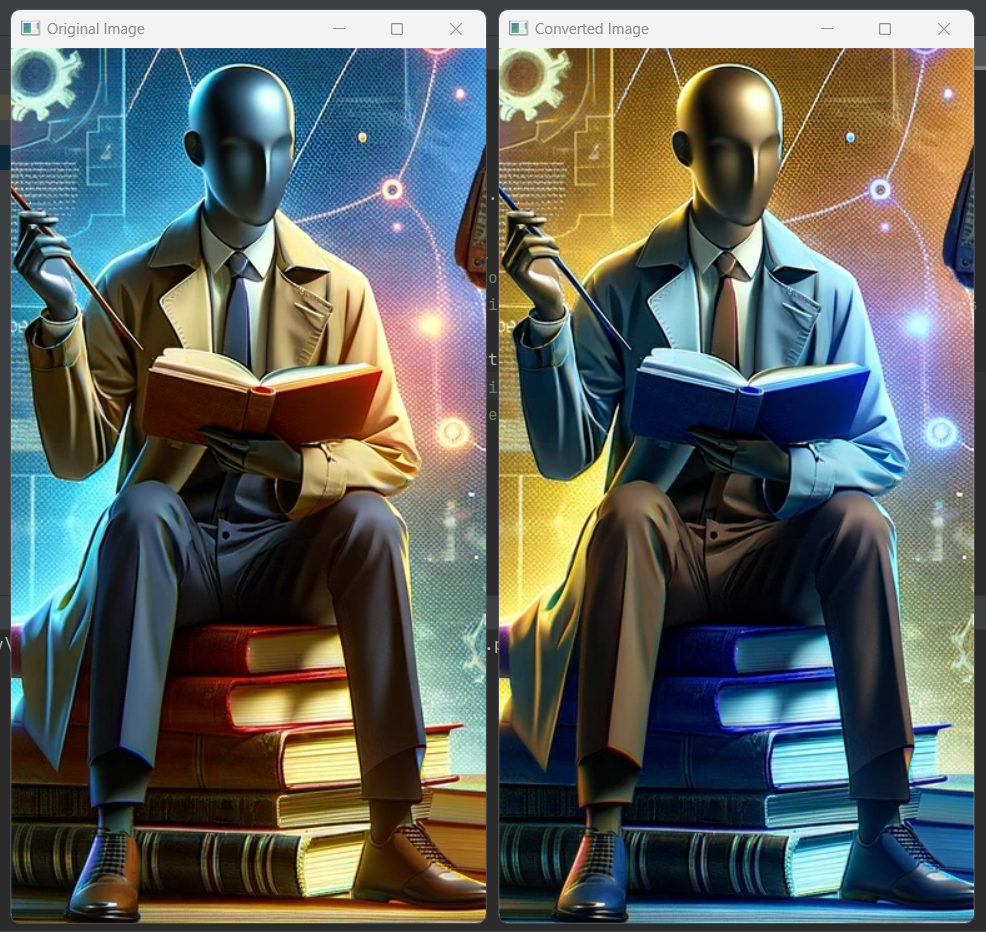
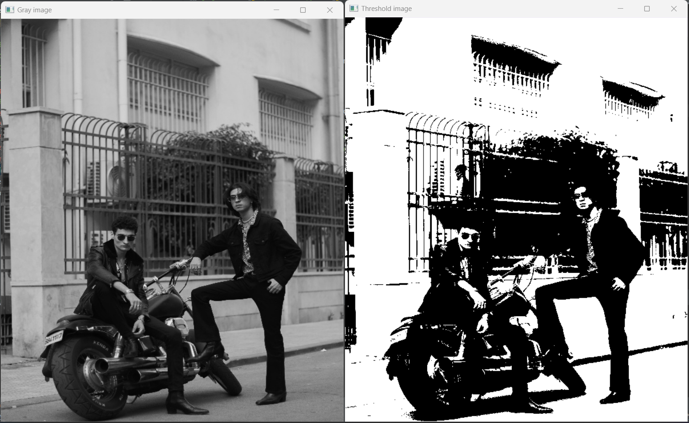
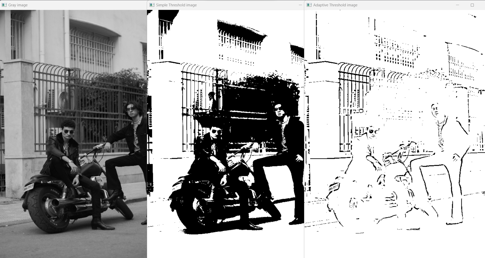
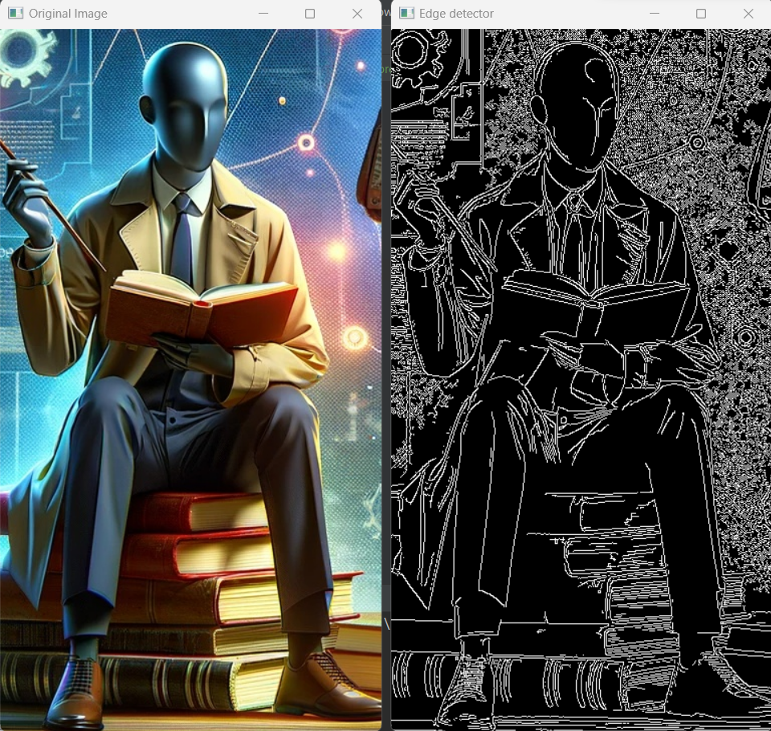
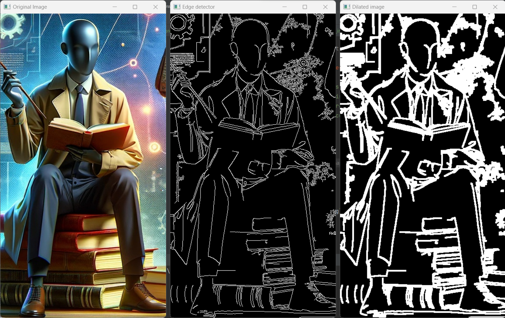
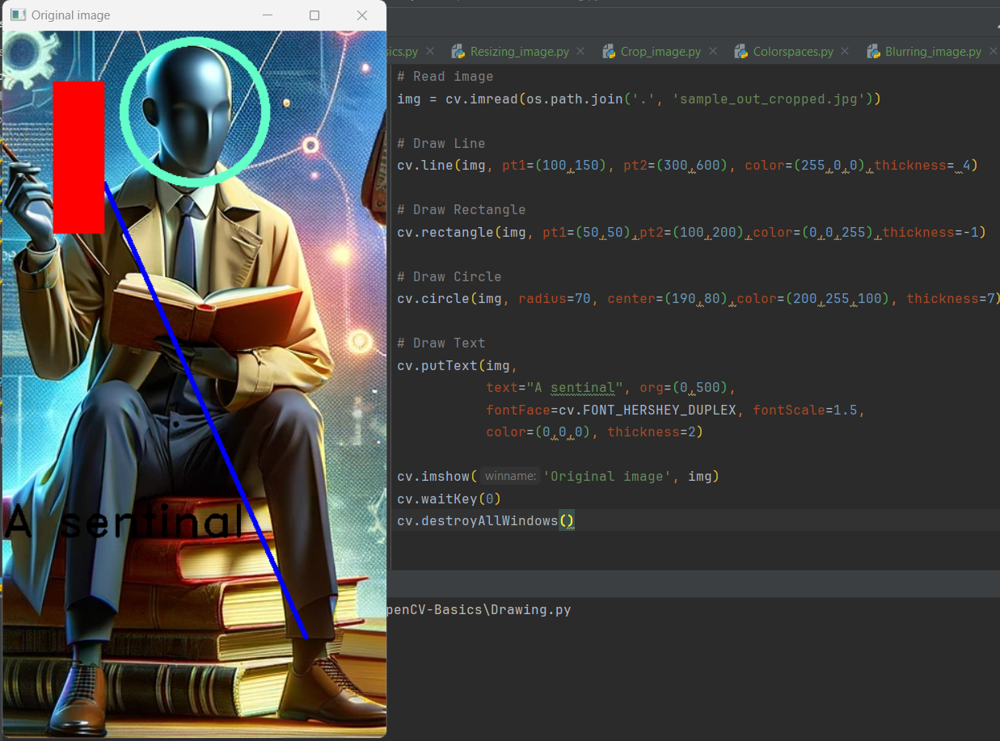
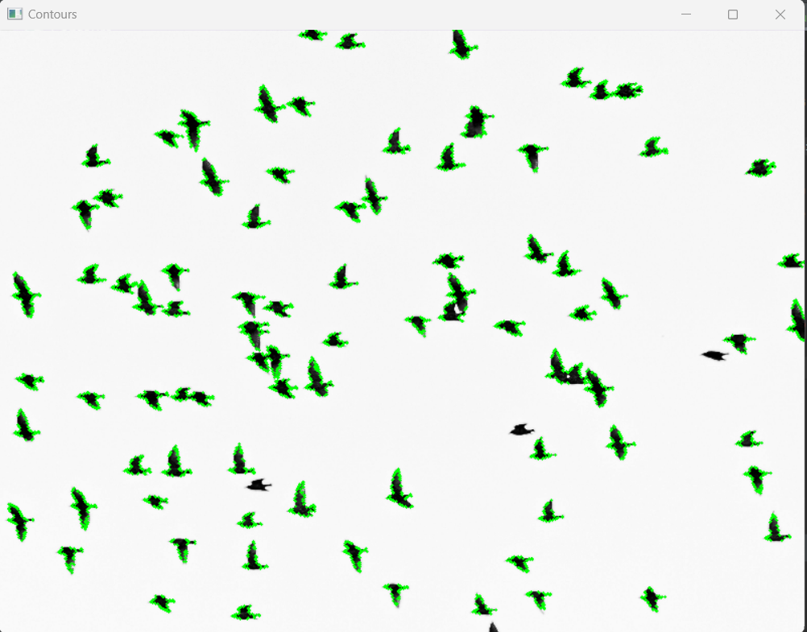
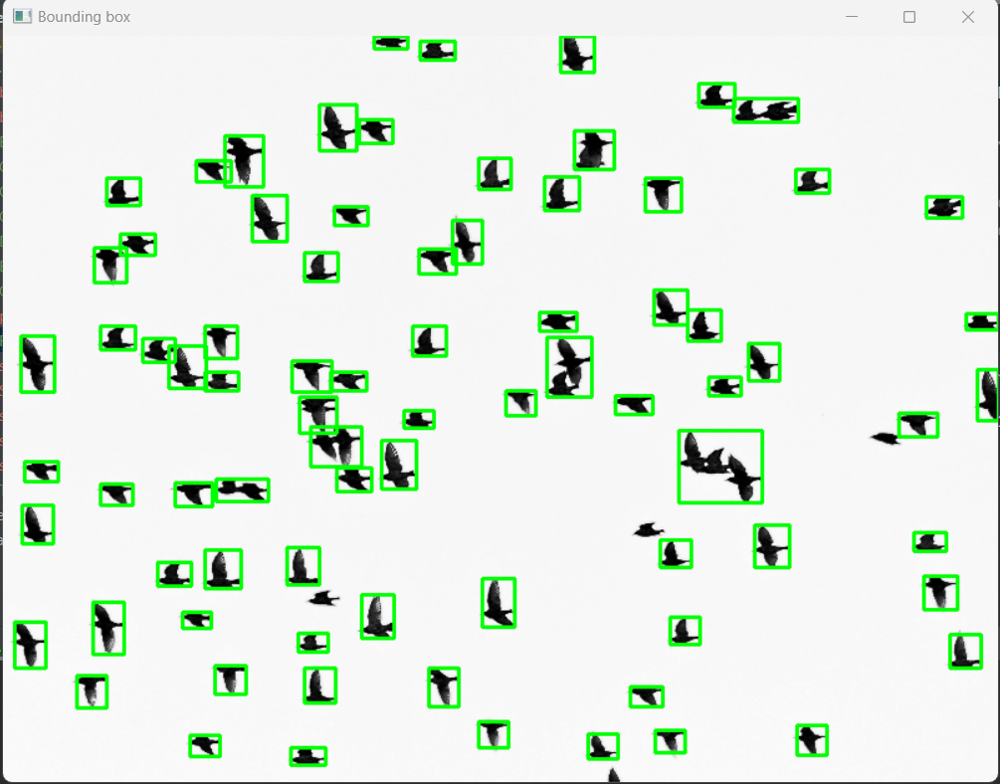
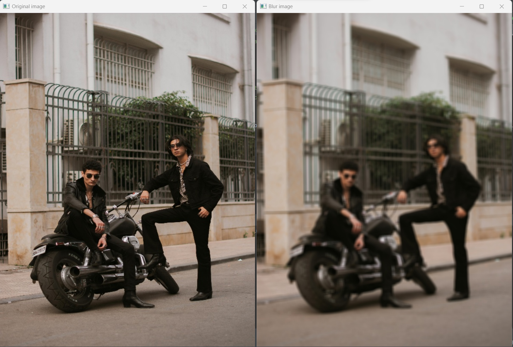
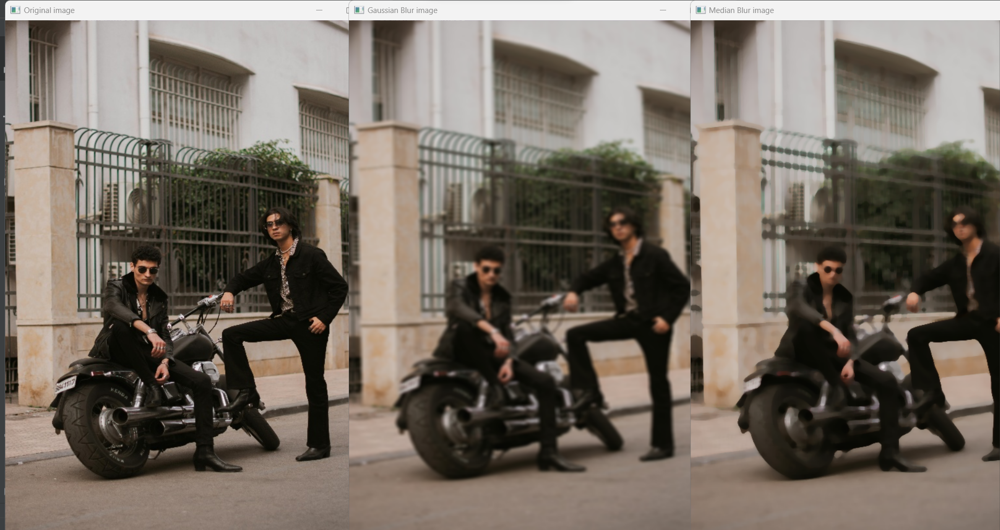

# OpenCV Image and Video Processing

This repository demonstrates various image and video processing techniques using the OpenCV library in Python.

## Prerequisites

Ensure you have `opencv-python` and `numpy` installed.

```bash
pip install opencv-python numpy
```

## Project Structure

- `persons-bike.jpg` - Sample image with persons and bikes.
- `sample.jpg` - Another sample image.
- `sample_out.jpg` - Sample output image.

## Functions and Use Cases

### 1. `cv.imread()`, `cv.imshow()` - Reading and Displaying Images

- **Use Case**: Read an image from disk and display it in a window.

### 2. `cv.cvtColor()` - Color Space Conversion

- **Use Case**: Convert an image from one color space to another, e.g., BGR to Grayscale.
- - **Screenshots**:
   

### 3. `cv.threshold()`, `cv.adaptiveThreshold()` - Thresholding

- **Use Case**: Convert an image to binary using simple or adaptive thresholding.
- **Screenshots**:
   
   

### 4. `cv.resize()` - Resizing Images

- **Use Case**: Resize an image to the desired dimensions.

### 5. `cv.VideoCapture()` - Basic Video Handling

- **Use Case**: Read frames from a video file and display them.

### 6. `cv.VideoCapture(0)` - Webcam Operations

- **Use Case**: Capture video from the webcam and display it in real-time.

### 7. `cv.Canny()`, `cv.dilate()` - Edge Detection and Dilation

- **Use Case**: Detect edges in an image and expand the boundaries of objects.
- **Screenshots**:
   
  

### 8. `cv.line()`, `cv.rectangle()`, `cv.circle()`, `cv.putText()` - Drawing Shapes and Text

- **Use Case**: Draw lines, rectangles, circles, and text on an image.
- - **Screenshots**:
   

### 9. Cropping an Image

- **Use Case**: Crop a region of interest from an image and save it.

### 10. `cv.findContours()`, `cv.rectangle()` - Contour Detection

- **Use Case**: Find contours in an image and draw bounding boxes around detected objects.
- **Screenshots**:
   
   

### 11. `cv.blur()`, `cv.GaussianBlur()`, `cv.medianBlur()` - Image Blurring

- **Use Case**: Apply different blurring techniques to reduce noise and detail in an image.
- **Screenshots**:
   
   

## Conclusion

This project covers a wide range of image and video processing techniques using OpenCV. Each function serves a specific purpose, from basic image manipulation to video handling and advanced image processing tasks. Feel free to experiment with the code to suit your needs.
